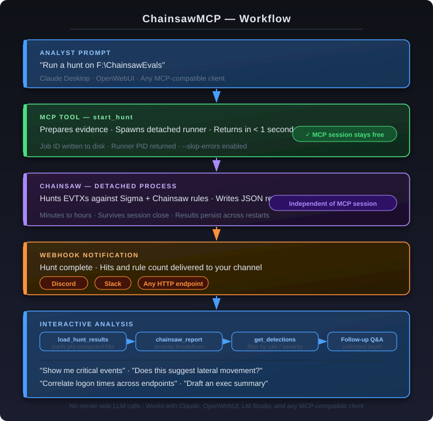

# ChainsawMCP

> **Incident response at scale — drop evidence, get answers.**

ChainsawMCP is a [Model Context Protocol](https://modelcontextprotocol.io/) server that bridges [Chainsaw](https://github.com/WithSecureLabs/chainsaw) — WithSecure's fast Windows Event Log threat hunting tool — with AI assistants. It is built for incident responders who need to analyse large volumes of Windows event logs quickly, without an EDR or SIEM in place.

Because the server makes no LLM calls of its own, it works equally well with **cloud models** (Claude Desktop) and **locally hosted models** (OpenWebUI + Ollama, LM Studio, or any MCP-compatible client) — keeping sensitive evidence off the internet if your engagement requires it.

---

## How It Works



The MCP server handles evidence preparation and Chainsaw execution. The AI client — Claude Desktop, OpenWebUI, LM Studio, or anything MCP-compatible — provides all the reasoning. The server makes no LLM calls.

---

## Key Design Decisions

### Detached Execution — No More Timeouts

The original approach embedded Chainsaw execution inside an MCP tool call. MCP clients have finite tool budgets, and a 30-minute Chainsaw run against 3+ GB of logs exceeded them. Every attempt to wait inline hit a timeout.

The fix: `start_hunt` spawns Chainsaw (via a Python runner process) using `CREATE_NEW_PROCESS_GROUP` on Windows and `start_new_session` on Linux. The process is fully independent — it survives MCP session close, client disconnect, and long idle periods. Job state is written to disk so results persist across sessions.

### Webhook Notification

A completion monitor runs alongside Chainsaw. When the hunt finishes, it updates the job record on disk and POSTs a notification to your configured webhook. Discord, Slack, and generic HTTP endpoints are all supported out of the box.

### Interactive Analysis, Not One-Shot Reports

Automatic report generation was considered and rejected. A one-shot report cannot answer follow-up questions. The right model: Chainsaw does the slow mechanical work offline; the MCP session is reserved for fast, interactive investigation where the analyst drives the conversation.

---

## Features

- **Detached hunt execution** — Chainsaw runs as an independent process; `start_hunt` returns in under one second
- **Webhook notifications** — Discord, Slack, and generic HTTP receivers supported
- **Persistent job state** — results survive session restarts; load any previous job by ID or automatically pick up the latest
- **E01 disk image support** — forensic images mounted and EVTXs extracted automatically on both Windows and Linux
- **Split E01 handling** — pass the first segment (`.E01`); multi-segment images resolved automatically
- **Cross-platform** — full support for Windows and Linux; binary names, mount tools, and process management all handled
- **Fault-tolerant hunting** — `--skip-errors` is always enabled; a single corrupt log file does not abort the entire hunt
- **Local LLM support** — works with OpenWebUI, LM Studio, Ollama, and any MCP-compatible client; sensitive evidence never has to leave your network
- **No server-side LLM calls** — the server is purely operational; all reasoning is provided by the client

---

## Requirements

### Runtime

| Requirement | Notes |
|---|---|
| Python 3.11+ | |
| [Chainsaw](https://github.com/WithSecureLabs/chainsaw/releases) | On `PATH` or set `CHAINSAW_BIN` |

### E01 Mounting — Linux

E01 images are extracted using `pytsk3` (The Sleuth Kit Python bindings) — **no root access, no FUSE mounts required.** pytsk3 is included in the package dependencies.

If pytsk3 is unavailable, the server falls back to the Sleuth Kit CLI tools:

```bash
sudo apt install sleuthkit
```

### E01 Mounting — Windows

[Arsenal Image Mounter CLI](https://arsenalrecon.com/products/arsenal-image-mounter) must be on `PATH` or set via `AIM_CLI`.

---

## Installation

```bash
git clone https://github.com/jasonmull/ChainsawMCP.git
cd ChainsawMCP
pip install -e .
```

---

## Configuration

All settings are environment variables, set in your MCP client config.

| Variable | Default | Description |
|---|---|---|
| `CHAINSAW_BIN` | `chainsaw` / `chainsaw.exe` | Path to Chainsaw binary |
| `CHAINSAW_RULES` | _(none)_ | Path to Chainsaw rules directory |
| `CHAINSAW_SIGMA` | _(none)_ | Path to Sigma detections directory |
| `CHAINSAW_MAPPING` | _(none)_ | Sigma mapping file — required when using Sigma rules |
| `CHAINSAWMCP_JOBS_DIR` | system temp / `chainsawmcp_jobs` | Where job state and results are stored |
| `CHAINSAWMCP_WEBHOOK_URL` | _(none)_ | Webhook URL to POST on hunt completion |
| `AIM_CLI` | `aim_cli.exe` | Windows only: path to Arsenal Image Mounter CLI |

> **Sigma mapping:** Chainsaw requires a mapping file to match Sigma field names to Windows Event Log fields. Chainsaw ships these in its `mappings/` directory — `sigma-event-logs-all.yml` is the standard choice.

---

## MCP Client Setup

ChainsawMCP works with any MCP-compatible client. Use **Claude Desktop** for cloud-based analysis or **OpenWebUI / LM Studio** to keep evidence entirely on your local network.

### Claude Desktop

Add to `claude_desktop_config.json`:

```json
{
  "mcpServers": {
    "ChainsawMCP": {
      "command": "ChainsawMCP",
      "env": {
        "CHAINSAW_BIN": "C:\\Tools\\chainsaw\\chainsaw.exe",
        "CHAINSAW_RULES": "C:\\Tools\\chainsaw\\rules",
        "CHAINSAW_SIGMA": "C:\\Tools\\chainsaw\\sigma\\rules",
        "CHAINSAW_MAPPING": "C:\\Tools\\chainsaw\\mappings\\sigma-event-logs-all.yml",
        "CHAINSAWMCP_JOBS_DIR": "C:\\ChainsawJobs",
        "CHAINSAWMCP_WEBHOOK_URL": "https://discord.com/api/webhooks/..."
      }
    }
  }
}
```

### Claude Code CLI

```bash
claude mcp add ChainsawMCP ChainsawMCP \
  -e CHAINSAW_BIN=/usr/local/bin/chainsaw \
  -e CHAINSAW_RULES=/opt/chainsaw/rules \
  -e CHAINSAW_SIGMA=/opt/chainsaw/sigma/rules \
  -e CHAINSAW_MAPPING=/opt/chainsaw/mappings/sigma-event-logs-all.yml \
  -e CHAINSAWMCP_JOBS_DIR=/opt/chainsawjobs \
  -e CHAINSAWMCP_WEBHOOK_URL=https://hooks.slack.com/...
```

### OpenWebUI (local LLM)

Start the server in HTTP mode and configure it as an MCP tool server in OpenWebUI:

```bash
CHAINSAW_BIN=/usr/local/bin/chainsaw \
CHAINSAW_RULES=/opt/chainsaw/rules \
CHAINSAWMCP_JOBS_DIR=/opt/chainsawjobs \
CHAINSAWMCP_WEBHOOK_URL=https://discord.com/api/webhooks/... \
ChainsawMCP --transport streamable-http
```

Then add `http://localhost:8000/mcp` as an MCP server in OpenWebUI under **Admin → External Tools**. Pair with any locally hosted model — Llama, Mistral, Qwen, or any model with strong instruction-following capability. Evidence never leaves your network.

---

## Tools

Tools are listed in execution order for a standard workflow.

---

### 1. `prepare_evidence` _(E01 images only)_

Mount a forensic E01 image, extract all `.evtx` files, and stage them for Chainsaw. Skip this step for EVTX directories — `start_hunt` handles those directly.

| Argument | Type | Description |
|---|---|---|
| `path` | string, **required** | Absolute path to an `.E01` file |

---

### 2. `start_hunt`

Start a Chainsaw hunt against an EVTX directory or E01 image. Returns in under one second — Chainsaw runs as a fully detached background process with no connection to the MCP session.

| Argument | Type | Description |
|---|---|---|
| `path` | string, **required** | Absolute path to an EVTX directory or `.E01` file |
| `rules_path` | string, optional | Override `CHAINSAW_RULES` |
| `sigma_path` | string, optional | Override `CHAINSAW_SIGMA` |
| `mapping_path` | string, optional | Override `CHAINSAW_MAPPING` |
| `extra_args` | array, optional | Extra flags passed verbatim to `chainsaw hunt` |

Returns a job ID and runner PID. A webhook POST fires when the hunt completes. `--skip-errors` is always enabled — a single corrupt log file will not abort the hunt.

---

### 3. `load_hunt_results`

Load results from a completed hunt into the session for analysis. If `job_id` is omitted, the most recently completed hunt is loaded automatically. Call this after receiving the webhook notification.

| Argument | Type | Description |
|---|---|---|
| `job_id` | string, optional | Job ID from `start_hunt`. Omit to load the latest. |

---

### 4. `chainsaw_report`

Write the full hunt report to disk and return a structured summary including severity breakdown (critical / high / medium / low / info), hit counts by rule, and top detections.

---

### 5. `get_detections`

Return individual events from the completed hunt, filtered by rule name or severity. Use this to drill into specific detections surfaced by `chainsaw_report`.

| Argument | Type | Description |
|---|---|---|
| `rule` | string, optional | Case-insensitive substring match on rule name |
| `severity` | string, optional | Exact severity level: `critical`, `high`, `medium`, `low`, `info` |
| `limit` | integer, optional | Max events to return (default: 25) |

---

## Typical Session

```
Analyst:  "Run a hunt on F:\ChainsawEvals"

Claude:   [calls start_hunt("F:\ChainsawEvals")]
          Hunt started (job ID: f2ef9e2d). Chainsaw is running in the background.
          You'll receive a webhook notification when it's done.

          [Chainsaw runs — takes 3 minutes for 296 files]

Discord:  ✅ ChainsawMCP hunt complete (job f2ef9e2d)
          Hits: 7098 across 74 rules
          Completed: 2026-05-30T17:53:22Z
          Call load_hunt_results() in your MCP session to begin analysis.

Analyst:  "Analyze the results"

Claude:   [calls load_hunt_results()]
          Loaded 7,098 hits from job f2ef9e2d (74 rules triggered).

          [calls chainsaw_report()]
          78 critical · 75 high · 413 medium · 155 low · 6377 info

          Top detections: RDP Session Disconnected, Security Audit Logs Cleared,
          Suspicious Remote Logon with Explicit Credentials, Remote Service Creation...

Analyst:  "Show me the critical detections"

Claude:   [calls get_detections(severity="critical", limit=50)]
          [returns and analyses 78 critical events]

Analyst:  "The audit log clearing and RDP activity — do these suggest a specific
           attack pattern?"

Claude:   [analyses event timeline, pivots on computer names and timestamps]
          Based on the sequence: logs were cleared on win10-test at 22:14 UTC,
          followed immediately by RDP logons from a new source...
```

---

## Architecture

```
ChainsawMCP/
├── src/
│   └── chainsawmcp/
│       ├── server.py       # MCP server, tool dispatch, session state
│       ├── evidence.py     # E01 mounting (ewfmount / Arsenal) and EVTX staging
│       ├── chainsaw.py     # Chainsaw subprocess wrapper; detached process spawning
│       ├── monitor.py      # Detached completion monitor; webhook notification
│       ├── jobs.py         # Disk-persisted job state management
│       ├── report.py       # Report formatter and severity summary
│       └── config.py       # Environment variable configuration
└── tests/
    └── test_chainsaw.py    # Full test suite; no Chainsaw binary required
```

### Job Lifecycle

```
start_hunt()
    │
    ├─ create_job()          writes job.json { status: "running", pid: ... }
    │
    ├─ spawn runner          python -m chainsawmcp.monitor <job_id> <cmd_json>
    │       │
    │       ├─ opens hunt_results.json
    │       ├─ runs chainsaw hunt (blocking, within runner process)
    │       ├─ updates job.json { status: "complete", hit_count: ..., completed_at: ... }
    │       └─ POSTs webhook
    │
    └─ returns immediately to MCP client

load_hunt_results()
    │
    ├─ reads job.json         finds latest completed job if no job_id given
    ├─ parses hunt_results.json
    └─ populates session state → chainsaw_report / get_detections ready
```

---

## Development

```bash
pip install -e ".[dev]"
pytest
```

The test suite mocks all subprocess calls — no Chainsaw binary or evidence files required.

---

## License

MIT
